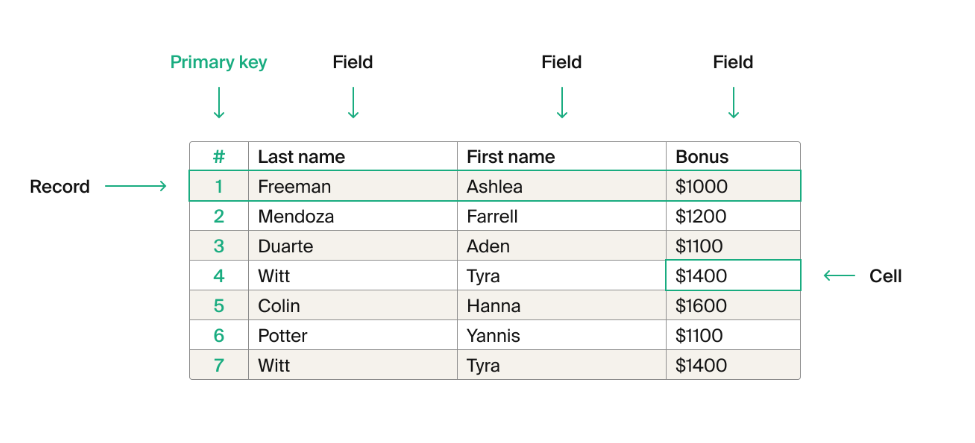

# Primary Keys

- relational database tables, should not contain duplicate records/rows.
- primary key = is a unique attribute / value is a unique identifier. This can be a number or set of characters.
